# DBeaver — Remote MySQL Database Handbook (step-by-step)

> A compact, hands-on guide to connect to **remote MySQL databases** using **DBeaver Community Edition**.

---

## Table of contents

1. Step 1 — Install DBeaver
2. Step 2 — Start the New MySQL Connection Wizard
3. Step 3 — Enter MySQL connection settings (host, port, database)
4. Step 4 — Driver download / Driver properties
5. Step 5 — Test & Save Connection
6. Step 6 — Basic usage: browse tables and run queries

---

## 1. Step 1 — Install DBeaver

1. Download DBeaver Community from the official site and follow the OS-specific installer steps.

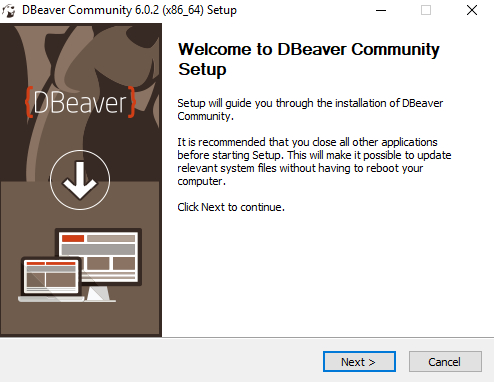
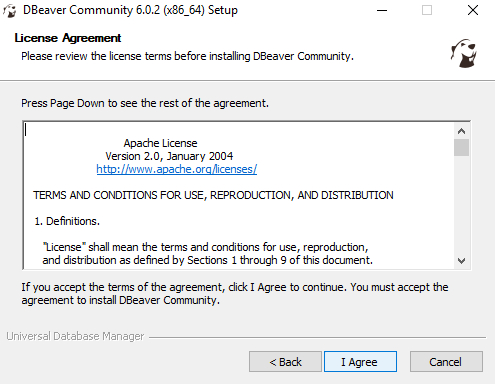
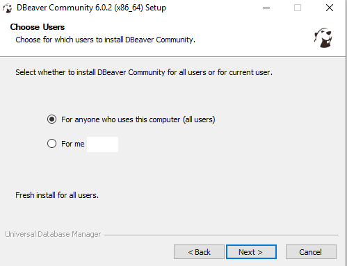
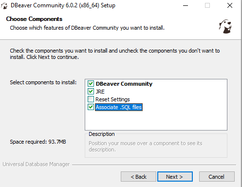
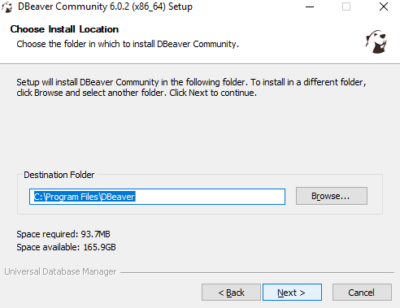
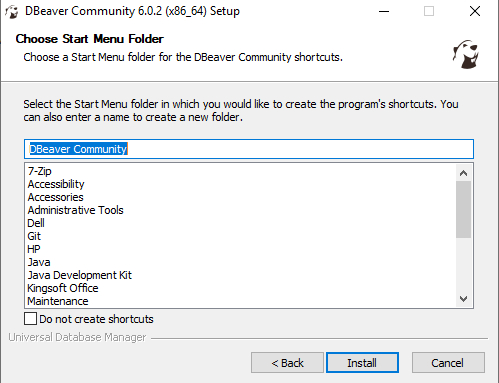

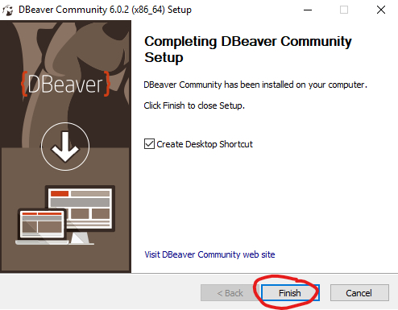

2. Launch DBeaver after installation.

---

## 2. Step 2 — Start the New MySQL Connection Wizard

1. Open DBeaver.
2. Click **Database → New Database Connection** or use the **New Connection** (plug) icon in the toolbar.

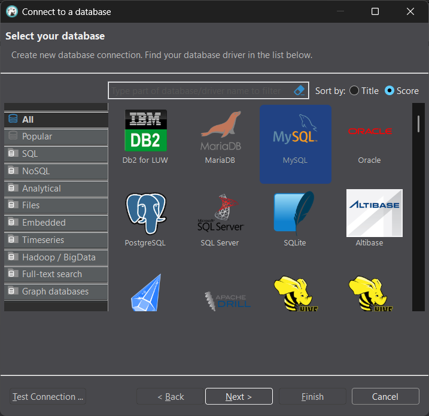

3. In the list, select **MySQL** and click **Next**.

---

## 3. Step 3 — Enter MySQL connection settings

1. Fill in the main fields shown in the connection dialog:
   - **Host**: `mysql.example.com` or `192.168.1.100`
   - **Port**: `3306`
   - **Database**: your MySQL schema name
   - **User name** & **Password**

```text
Example:
Host: mysql.example.com
Port: 3306
Database: employees
User: report_user
Password: ********
```

2. (Optional) Set **Connection name** to something descriptive (e.g., `mysql-prod-readonly`).

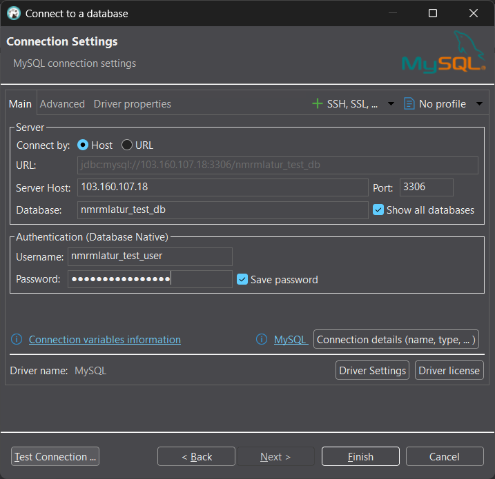

---

## 4. Step 4 — Driver download / Driver properties

- If the MySQL JDBC driver is not present, DBeaver will prompt to download it. Click **Download**.

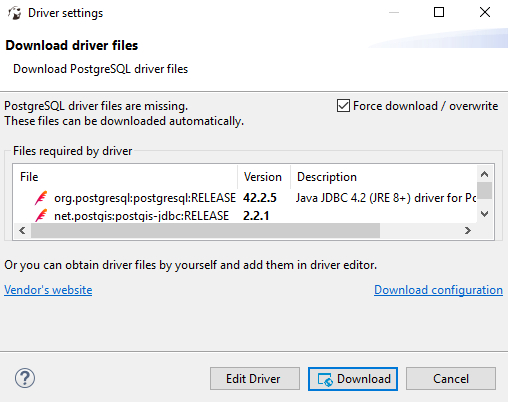

- Advanced: open **Driver properties** to add SSL, timezone, or character set parameters if needed.

---

## 5. Step 5 — Test & Save Connection

1. Click **Test Connection** to validate MySQL settings.
2. If the test is successful, click **Finish** to save the connection.

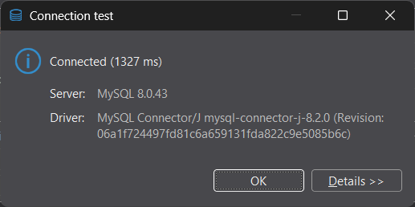

3. Your MySQL connection will appear in the **Database Navigator**.

---

## 6. Step 6 — Basic usage: browse tables and run queries

- Expand the MySQL connection in **Database Navigator** → Schemas → Tables.
- Right-click a table → **View Data** to see rows.
- To run queries: Right-click the connection → **SQL Editor → New SQL Script** or press `Ctrl+Enter`.

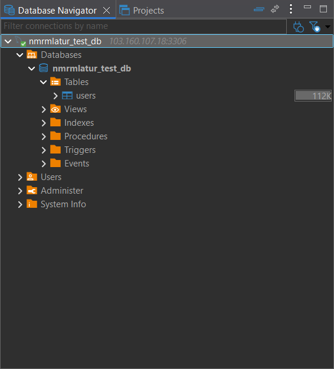
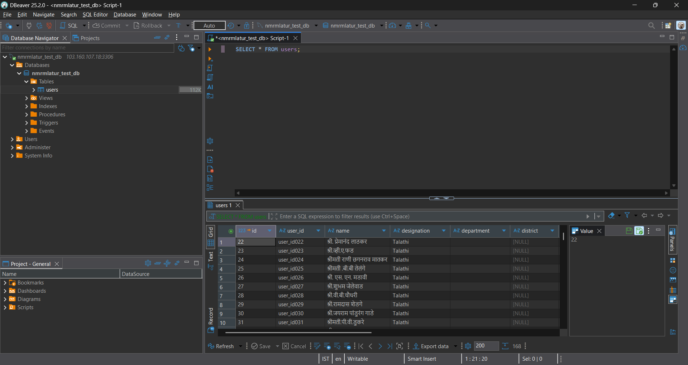

---

_End of handbook_
